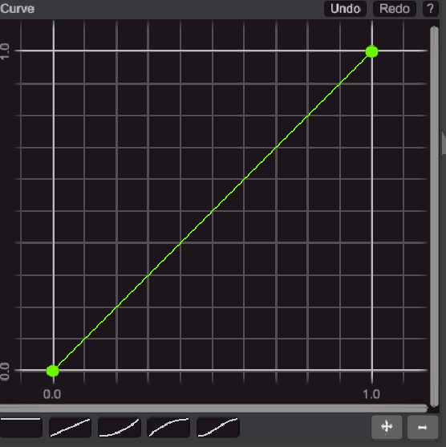
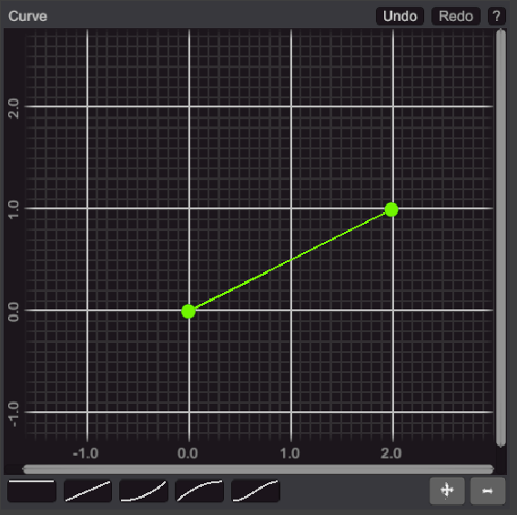
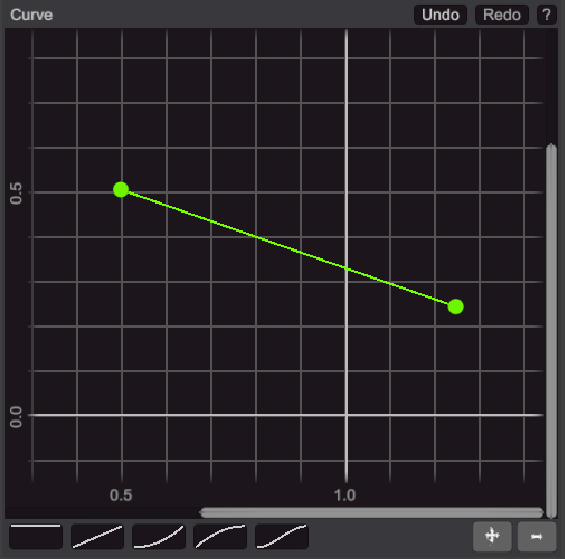
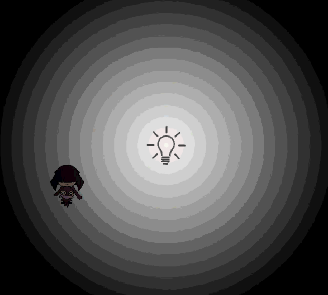
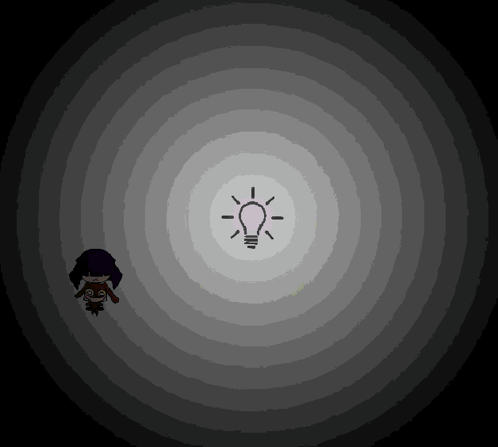
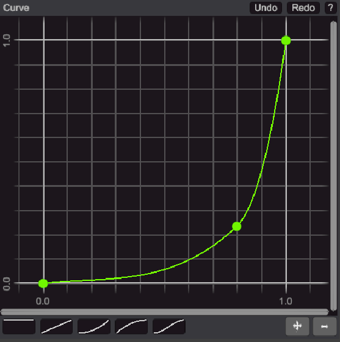
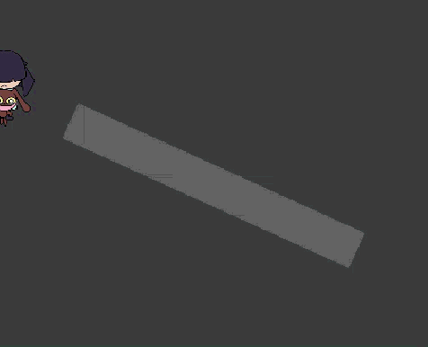

# Introducción

He decidido usar **Animation Curves** y **Lerp** en nuestro Editor de Niveles.
 El problema es que, no todo el mundo sabe como usarlo, pero intentaré explicarlo en este documento.
  
Un **uso** de las Animation Curves es describir algo que **varí­a a travez del tiempo**
 Vayamos a un ejemplo

# Intensidad con cambio lineal

En mi Editor de Niveles, puedes describir como quieres que varí­e la intensidad de una luz a travez del tiempo.
 Si dibujas una curva que, **horizontalmente**, va de 0 hasta 1, la variación de intensidad **durará un segundo**.  
 El comportamiento después del primer segundo va a depender de la configuración Post Wrap (hablaremos de eso mas adelante).
  
Entonces, ya sabes que es lo que pasa con la curva horizontalmente (tiempo en segundos).
Pero... ¿Qué significa el **eje vertical**? O... ¿Cómo la **forma** de la l­í­nea de la curva afecta los usos de Animation Curve?
 Bueno, empezemos interpretandolo como la intensidad de una luz.  
 Si el primer punto de la lí­nea coí­ncide verticalmente con el valor 0, significa que la luz estará **apagada**. Y el valor 1 significa que estará prendida con una **intensidad fuerte**.
  Si dibujas una lí­nea recta desde el punto (0,0) hasta el punto (1,1), entonces la luz **empezará apagada**, y **gradualmente** y **uniformemente** irá subiendo su intensidad hasta alcanzar, en un segundo, la intensidad de valor 1, finalmente.
 

  LLendo mas allá, ahora si la linea recta va desde (0,0) hasta (2,1), la luz también irá de 0 a 1, pero esta vez tardará 2 segundos, porque el valor del eje **horizontal** del segundo punto es 2.
 

  Entonces, si por ejemplo quisieras una variación que comienze con la luz iluminando a medias, que uniformemente disminuya hasta un cuarto de iluminacion, y empieze a los 0.5 segundos y termine a los 1,5 segundos... entonces harí­as una lí­nea recta que vaya desde el punto (0.5,0.5) hasta el punto (1.5,0.25) 
 

  ¿Se entiende por qué? Presta atención a los numeros de **cada punto**. Recuerda, el **primer** numero es **tiempo**, el **segundo** es la **variable de animación** (intensidad de la luz en este caso).
 En este caso, los segundos no empiezan desde cero, entonces es cuando el **pre wrap** entra en acción. (Explicaré en corto como funciona) 
 LLendo mas allá, podemos hacer mas de dos puntos, y crear diferentes transiciones a travez del tiempo. 

# Pre and Post Wrap

Nos enfocaremos en el post wrap y el pre wrap. ¿Que pasa con la animación fuera de los limites de la curva? Puede haber tres comportamientos **clamp, loop y ping-pong**

**Clamp** significa que tomará el valor del último punto y lo usará por toda la eternidad.
 Si tomamos el primer ejemplo (desde (0,0) hasta (1,1)) y configuramos el post wrap como clamp, luego de pasar el limite, la curva valerá 1 verticalmente durante todos los segundos posteriores.
 Y, en el tercer ejemplo ((0.5,0.5) to (1.5, 0.25)), la luz comenzará con intensidad 0.5 desde el segundo cero hasta el segundo 0.5, ya que esto estaba fuera del limite inicial. Esto serí­a un ejemplo de pre wrap clamp. 

Ahora, veremos como funciona el commportamiento **Loop**. Esto simplemente repite infinitamente el mismo patrón de la curva que hicimos durante toda la eternidad. Si la curva empieza en 0 verticalmente, y termina en 1, entonces luego de eso, volverá a empezar en 0, y terminará en 1, describiendo la misma forma de curva que habí­amos hecho. Y así­ sucesivamente. 
Lo mismo pasa con el pre wrap, si empezamos en un tiempo mayor a cero, lo anterior a esto sera una replica de la misma curva precediendo la misma. Antes del limite izquierdo, tomará el ultimo valor de la curva, y retrocederá dibujando ls misma curva hasta llegar hasta el tiempo 0.

 

Finalmente, queda explicar **Ping Pong**. Es similar a loop, pero cada vez que repite la curva, la espeja. Por ejemplo, si la curva va desde (0,0) hasta (1,1), entonces luego irá desde (1,1) hasta (0,0) describiendo la curva original pero espejada. Luego de eso, la vuelve a espejar, por lo que queda la curva original. Luego espejada otra vez, y luego original otra vez. Así­ eternamente.

 

Notar que, en Loop, la intensidad de la luz va desde 0 a 1, y despues repentinamente cambia a 0, para ir a 1 de vuelta.
En cambio, en Ping Pong, la luz tiene mas continuidad, ya que va desde 0 a 1, luego de 1 a 0, luego de 0 a 1, y asi sucesivamente.
A veces PingPong es una solución mas elegante.
Pero si diseñas una curva que empieza y termina con la misma intensidad, entonces capaz sea mejor usar Loop.

# Intensidad con un cambio no lineal

Por ahora, hemos hablado de lineas rectas, ¿Pero qué pasa con las lineas curvas?
 Esta es la parte interesante, porque aquí­ comienza tu creatividad, ya que es es una herramienta que dará movimmientos originales, suaves, o muy rapidos, o en un principio suaves y luego rápidos, la posibilidad de formas es infinita. 
  
Por ejemplo, imaginemos una curva que va desde (0,0) a (1,1) pero con esta forma: 
 
 Esto significa que los valores iniciales van a variar ligeramente, suave. Pero hacia el final va a cambiar con un monton de velocidad. ¿Entiendes esto en la forma de la curva? Una linea que tiende a ser horizontal, implica cambios suaves, mientras que una linea tendiendo a forma vertical implica cambios bruscos en el tiempo. Entonces la variacion no es mas lineal, ahora tiene movimientos mas naturales.
  Por ejemplo, puedes hacer una luz una luz que se prende suavemente, pero cuando alcanza la mitad empieza a disminuir hacia un cuarto, luego que vaya rapidamente hacia la máxima intensidad, entonces abruptamente va a 0 y se queda ahí­ por un tiempo, luego que haga todo lo mismo pero espejado con el post wrap ping pong. Entonces tendrás una salvaje e impredecible luz. 

# Other animations

Ok. We are ready to jump to the next level, LERP.
 Lerp transforms values that goes from 0 to 1, to a Min to Max value, or value 0 to value 1, as i named in the level editor. I prefer this names because not always the names go from smaller to taller. But always go from value 0 and 1 in the vertical axe of the curve.
  
Then, think that you have to make an vertical scale of a wall, you will need a scale from 1 to 5. For some reason is difficult configurate the curve editor for vertical values beyond 2, that is the reason that i use LERP. You have to setup value 0 and value 1 in the animation properties, to 1 and 5 respectively.
Then you do it, simply draw a curve between (0,1) to (1,1) and the size will change from 1 to 5, and will last 1 second. Thanks to LERP.
  LERP asigns variables linearly. That means if value 1 is 5, value 0.5 is 2.5, and value 2 is 10.
 Again, with this you can imagine whatever you want. You can decrease size, you can change slowly, and fastly. You can rice and decrease in the same curve with more than 2 points, and move and rotate lines as you want. Your creativity is the limit.

# Rotate animation

Using the idea of LERP. You can do rotation variation too. Only that the value 0 will be an angle and value 1 will be another angle.
 For example, to rotate continuously 360 degrees, you can set up angle 0 to 0 and angle 1 to 360. And in the curve make a straight line between (0,0) and (1,1) if you want a complete rotation in 1 second (by example).
 You can put another angle, and is not necessary and angle 0 minor to angle 1, that's not important to LERP. You can slowly go from (0,0) to (1.25,0.5) (from angle 0 to half of angle 1 in 1.25 seconds) then wait 3 seconds in the same value (completely horizontal line) this means go to (4.25, 0.5), then go to (6,0.75) (75% of angle 1 in 1.75 seconds more) faster, and so on.

With complex movements you can build an easy animation that confuse the player, or make more easy to play too, it's a very powerful tool. Because of that I decided use it, affording the dificulty learn curve.

# Complex animation example

In this example, we will see a rotation animation. With angle 0 set to 0, and angle 1 set to 90 degrees. With a slow start but a fast finish, using three points. And with a ping pong end wrap. Here are the curve and the motion gif.
 
 

