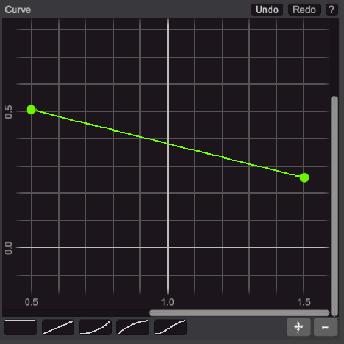
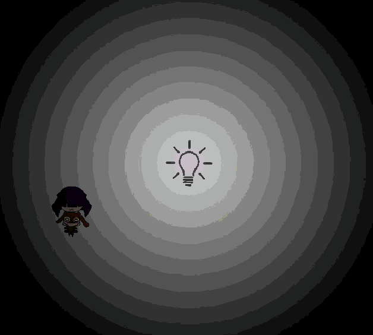

# Introduction

I decided to use **Animation Curves** and **Lerp** in my Level Editor.
 The problem, not anyone knows how it works, but i will try explain it in this doc.
  
One use of Animation Curves is to describe how something **varies over time**.
 Lets to go to an example

# Intensity with linear change

In my Level Editor, you can describe how intensity of light varies in time.
 If you draw a curve that, **horizontally**, goes from 0 to 1, the variation of intensity **will last one second**. 
 The behaviour after the first second will depend of the configuration of post wrap (we will talk about this, later).
  
Then, you now already know what mean the horizontal axe of the curve (time in seconds).
But... What mean the **vertical axe**? Or... How the **shape** of the line of the curve affects the uses of a animation curve? 
 Well, think in first place an intensity of light. 
 If the first point of the line matches vertically with the number 0, that means that the light will be **off**. And 1 means that the light will be on a **strong** intensity. 
  If you draw a **straight line** from (0,0) to (1,1), then that means that the light will **start off**, and **gradually** and **uniformly** Will increase to reach, in one second, an intensity of 1, finally.
 

  Furthermore, if the straight line goes from (0,0) to (2,1) the light will vary from off to intensity 1, but this time the transition will last 2 seconds, because the line measure 2 in the **horizontal** axe.
 

  If you want a variation of light starting half iluminated that uniformly decrease to quarter iluminated, and everything goes from the second 0,5 and 1,5 seconds. Then you have to draw a curve that goes from point (0.5, 0.5) to the point (1.5,0.25) 
 

  Understood? Pay attention to the **points** **numbers**, remember, **first** number is **time**, **second** number is the **animation variable** (light intensity in this case).
 In this case, seconds not start from zero, then that's when the pre wrap configuration takes important meaning. (I will explain in a bit how it works)
 Therefore, we can do more than 2 points, and create different transitions across the time.

# Pre and Post Wrap

We will focus in post wrap and pre wrap. What happen when the curve exceds the limits? There are 3 behaviours, **clamp, loop and ping-pong**.

**Clamp** means that will take the last point and use that value for eternity. 
 If we take the first example (from (0,0) to (1,1)), after 1 second, the light will remain turned on. This is a clamp post wrap.
 Or, in the third example ((0.5,0.5) to (1.5, 0.25)), the light will start in time zero with 0.5 intensity until the curve start varying (in time 0.5). This is a clamp pre wrap.

Then, we will see how **Loop** works. This just repeat infinitelly the same patreon of The curve. If the curve starts with 0 intensity and ends in 1. Then after that will take 0 intensity and linearly increments to 1 again. And so on.
The same will happen with prewrap configuration, but before the first point of the curve. If starts with 0, then will be preceded with a curve from 0 to 1.

 

Finally, how works **Ping Pong**? Similar to Loop, but mirroring the shape every time. For example, if the curves goes from (0,0) to (1,1), the next time will go to (1,1) to (0,0). The next time will mirror again, and so on.

 

Note that, in Loop, the light intensity will raise from 0 to 1, and go to 0 suddenly and raise to 1 again.
But, in Ping Pong the light raise from 0 to 1, then decrease from 1 to 0, and so on.
Sometimes Ping Pong is more elegant solution.
But, if you design a curve that start and ends in the same intensity, then you will use Loop probably.

# Intensity with non linear change

But, for now, we talked of straight lines. What happen with Curved lines? 
 This Is the juicy part, because here starts your creativity, you will have a tool to make more original movements, smooth or very fast, or in begining smooth and then very fast, the posibility of shapes are infinite.
  
For example, imagine a conection from (0,0) to (1,1) again, but with this form
 
 That means that the initial variation will slowly change, but in the end will change with a lot of speed. Did you understand this with the shape? A more horizontal líne means slow change, and a more vertical curve means fast change. Then the variation is not linear anymore, and adds more natural movements.
  For example you can make a light slowly turn on, but when take half, decrease to quarter, anda then go fast to max intensity, then abruptly go to 0 and stand this a while, then do the oposingo behaviour configurating ping Pong post wrap. Then you have it, a very naughty and a little unpredictible light.

# Other animations

Ok. We are ready to jump to the next level, LERP.
 Lerp transforms values that goes from 0 to 1, to a Min to Max value, or value 0 to value 1, as i named in the level editor. I prefer this names because not always the names go from smaller to taller. But always go from value 0 and 1 in the vertical axe of the curve.
  
Then, think that you have to make an vertical scale of a wall, you will need a scale from 1 to 5. For some reason is difficult configurate the curve editor for vertical values beyond 2, that is the reason that i use LERP. You have to setup value 0 and value 1 in the animation properties, to 1 and 5 respectively.
Then you do it, simply draw a curve between (0,1) to (1,1) and the size will change from 1 to 5, and will last 1 second. Thanks to LERP.
  LERP asigns variables linearly. That means if value 1 is 5, value 0.5 is 2.5, and value 2 is 10.
 Again, with this you can imagine whatever you want. You can decrease size, you can change slowly, and fastly. You can rice and decrease in the same curve with more than 2 points, and move and rotate lines as you want. Your creativity is the limit.

# Rotate animation

Using the idea of LERP. You can do rotation variation too. Only that the value 0 will be an angle and value 1 will be another angle.
 For example, to rotate continuously 360 degrees, you can set up angle 0 to 0 and angle 1 to 360. And in the curve make a straight line between (0,0) and (1,1) if you want a complete rotation in 1 second (by example).
 You can put another angle, and is not necessary and angle 0 minor to angle 1, that's not important to LERP. You can slowly go from (0,0) to (1.25,0.5) (from angle 0 to half of angle 1 in 1.25 seconds) then wait 3 seconds in the same value (completely horizontal line) this means go to (4.25, 0.5), then go to (6,0.75) (75% of angle 1 in 1.75 seconds more) faster, and so on.

With complex movements you can build an easy animation that confuse the player, or make more easy to play too, it's a very powerful tool. Because of that I decided use it, affording the dificulty learn curve.

# Complex animation example

In this example, we will see a rotation animation. With angle 0 set to 0, and angle 1 set to 90 degrees. With a slow start but a fast finish, using three points. And with a ping pong end wrap. Here are the curve and the motion gif.
 
 

